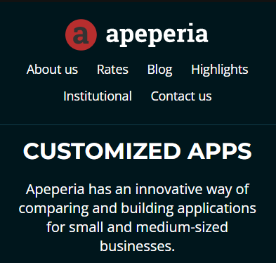

# Apeperia: 

_Para a versão em Português, clique [aqui](#portuguese)._

Apeperia is an agency that specializes in creating custom applications for small and medium-sized businesses.

  <figure>
    
  </figure>

## Overview

This page was developed during the course 'Responsive Layout - Mobile First' at [Alura](https://www.alura.com.br) technology school.

## Languages used:

  
  

## The result

Mobile

Tablet 

Desktop 

---

## Visão geral

Apeperia é uma agência especializada em criar aplicações customizadas para pequenos e médios negócios.
 
## Sobre o curso

Essa página foi desenvolvida durante o curso de 'Layout reponsivo - Mobile First da escola de tecnologia [Alura](https://www.alura.com.br).
  
  
## Linguagens utilizadas :

  

    
    
  

  
  
